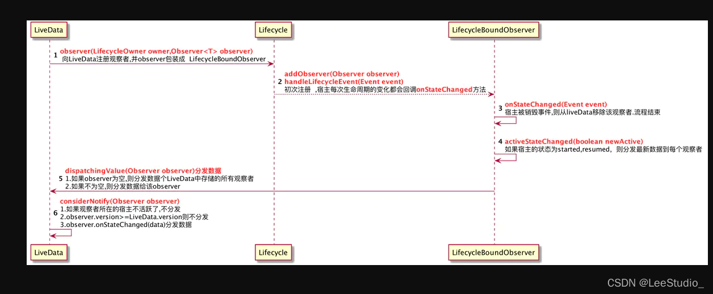

# LiveData

## Livedata是什么？它的作用是什么？我们能用它来干什么？

首先，LiveData是一种可观察的数据存储类。这句话可以看成两个部分，一个是可观察的类，另一个是数据存储的类。

- LiveData 是可以被观察的， 但是与常规的可观察类不同，Livadata具有感知生命周期的能力。意指它遵循其他应用组件（如 activity、fragment 或 service）的生命周期。有这种感知能力的LiveData ，只会通知活跃生命周期状态的应用组件观察者。
- LiveData是用来存储数据的，这是它最直接的作用。当LiveData的数据发生变化的时候，就会通知应用组建的观察者。

Observe类的生命周期处于Start或者Resumed状态时候，LiveData就认为Observe类处于活跃状态。也就是说LiveData只会通知活跃的观察者，也就是说处于其他生命周期的观察者，即使LiveData发生了变化，也不会收到通知。这样的好处是避免了内存泄露。

## LiveData的优势：

1. 确保界面符合数据状态
2. 不会发生内存泄漏
3. 不会因 Activity 停止而导致崩溃
4. 不再需要手动处理生命周期
5. 数据始终保持最新状态
6. 适当的配置更改
7. 共享资源

## LIveData的使用：

1. 创建LiveData实例，用来存储某种类型的数据。我们通常在ViewModel中完成。

```java
public class NameViewModel extends ViewModel {
// Create a LiveData with a String
private MutableLiveData<String> currentName;

    public MutableLiveData<String> getCurrentName() {
        //有一个判空
        if (currentName == null) {
            currentName = new MutableLiveData<String>();
        }
        return currentName;
    }
// Rest of the ViewModel...
}
```

2. 我们使用LiveData的方式主要有两种。
   - 一种是继承LiveData的子类MutableLIveData。因为LiveData是一个抽象类，我们不能直接继承，所以我们只能继承他的子类。
   - 一种是创建可定义 onChanged() 方法的 Observer 对象，该方法可以控制当 LiveData 对象存储的数据更改时会发生什么。通常情况下，您可以在界面控制器（如 activity 或 fragment）中创建 Observer 对象。
3. 使用 observe() 方法将 Observer 对象附加到 LiveData 对象。observe() 方法会采用 LifecycleOwner 对象。这样会使 Observer 对象订阅 LiveData 对象，以使其收到有关更改的通知。通常情况下，您可以在界面控制器（如 activity 或 fragment）中附加 Observer 对象。

## LiveData的部分源码分析

### MutableLiveData对外公开数据更新

LiveData的子类MutableLiveData，是我们可以直接使用的子类。在LiveData 里面没有公开的方法来更新存储的数据，但是在MutableLiveData中给我们提供了两个修改LiveData对象值的方法：setValue(T)和postValue(T)。同样这个两个方法也是重写了LiveData里面的方法。这两个方法分别适用在不同的线程里面。

```java
package androidx.lifecycle;

/**
 * {@link LiveData} which publicly exposes {@link #setValue(T)} and {@link #postValue(T)} method.
 *
 * @param <T> The type of data hold by this instance
 */
@SuppressWarnings("WeakerAccess")
public class MutableLiveData<T> extends LiveData<T> {

    /**
     * Creates a MutableLiveData initialized with the given {@code value}.
     *
     * @param value initial value
     */
    public MutableLiveData(T value) {
        super(value);
    }

    /**
     * Creates a MutableLiveData with no value assigned to it.
     */
    public MutableLiveData() {
        super();
    }
/**
 * 如果有活动的观察者，值将被发送给他们。
 * @param value 新值
 * 只能在主线程调用
 */
    @Override
    public void postValue(T value) {
        super.postValue(value);
    }
/**
 * 如果有活动的观察者，值将被发送给他们。
 * @param value 新值
 * 只能在子线程调用
 */
    @Override
    public void setValue(T value) {
        super.setValue(value);
    }
}
```

### observe订阅源码分析

obeserve订阅有两个方法。一个感知生命周期observe（），一个不感知生命周期observeForever（）。

注册observe的方法需要传入两个参数，分别是生命周期的拥有者（一般是Activity、Fragment、Service）接收事件的观察者。

```java
@MainThread
public void observe(@NonNull LifecycleOwner owner, @NonNull Observer<? super T> observer) {
    assertMainThread("observe");
    if (owner.getLifecycle().getCurrentState() == DESTROYED) {
        // ignore
        return;
    }
    LifecycleBoundObserver wrapper = new LifecycleBoundObserver(owner, observer);
    ObserverWrapper existing = mObservers.putIfAbsent(observer, wrapper);
    if (existing != null && !existing.isAttachedTo(owner)) {
        throw new IllegalArgumentException("Cannot add the same observer"
                + " with different lifecycles");
    }
    if (existing != null) {
        return;
    }
    owner.getLifecycle().addObserver(wrapper);
}
```

下面我们逐句分析：

1. 这个方法执行必须在主线程，否则抛出异常。
2. 生命周期的拥有者不能是destoryed状态，否则结束方法。或者说忽视订阅请求
3. 对生命周期的拥有者lifecycleOwner和事件的观察者observer进行包装注册成一个LifecycleBoundObserver对象，这就是为什么LiveData能够感知生命周期的原因。
4. 封包和观察者必须是对应的，一个观察者不能同时观察多个生命周期。但是一个生命周期可以绑定多个观察者
5. 添加观察者，这里可以很清楚的看到，添加的观察者是wrapper，而不是我们传入的observer参数。

```java
@MainThread
public void observeForever(@NonNull Observer<? super T> observer) {
    assertMainThread("observeForever");
    AlwaysActiveObserver wrapper = new AlwaysActiveObserver(observer);
    ObserverWrapper existing = mObservers.putIfAbsent(observer, wrapper);
    if (existing != null && existing instanceof LiveData.LifecycleBoundObserver) {
        throw new IllegalArgumentException("Cannot add the same observer"
                + " with different lifecycles");
    }
    if (existing != null) {
        return;
    }
    wrapper.activeStateChanged(true);
}
```

结论：这个方法创建的观察者，会永远收到数据变化的回调，在组件销毁时，需要用户手动的removObserver（）。

逐句分析：

1. 这里我们只传入了我们想设定的observer。没有传入生命周期的拥有者。
2. 将observer包装成AlwaysActiviteObserver实例。同样wrapper和observer是对应的，如果已经添加到了LIveData，那么就抛出异常。

3. activeStateChanged（）方法传入true。将观察者立刻设置成活动态。它会一直保持在活动态，这就是他一直收到数据变化回调的秘诀。

### observe移除源码

LiveData提供的observe移除方法也有两种，一种是移除removeObserve（）方法传入的观察者。另一种是移除removeObserve（）方法传入的生命周期拥有者，这样就会直接移除该生命周期所有绑定的观察者。

```java
public void removeObserver(@NonNull final Observer<? super T> observer) {
    assertMainThread("removeObserver");
    ObserverWrapper removed = mObservers.remove(observer);
    if (removed == null) {
        return;
    }
    removed.detachObserver();
    removed.activeStateChanged(false);
}
```

源码分析：

1. 判断主线程
2. 分离观察者和生命周期拥有者
3. 将观察者的一直设置成不活动态。

```java
@SuppressWarnings("WeakerAccess")
@MainThread
public void removeObservers(@NonNull final LifecycleOwner owner) {
    assertMainThread("removeObservers");
    for (Map.Entry<Observer<? super T>, ObserverWrapper> entry : mObservers) {
        if (entry.getValue().isAttachedTo(owner)) {
            removeObserver(entry.getKey());
        }
    }
}
```

这里明显进行了一次遍历，逐一调用移除单个Observe的方法。

### LIfecycleBoundObserverl 类 和 AlwaysActiveObserver 类

这两个类就是上面我们包装形成wrapper，他们都继承了ObserWrapper。

```java
class LifecycleBoundObserver extends ObserverWrapper implements GenericLifecycleObserver {
    @NonNull
    final LifecycleOwner mOwner;

    LifecycleBoundObserver(@NonNull LifecycleOwner owner, Observer<? super T> observer) {
        super(observer);
        mOwner = owner;
    }
//活动态，返回true
    @Override
    boolean shouldBeActive() {
        return mOwner.getLifecycle().getCurrentState().isAtLeast(STARTED);
    }

    @Override
    public void onStateChanged(LifecycleOwner source, Lifecycle.Event event) {
        if (mOwner.getLifecycle().getCurrentState() == DESTROYED) {
            removeObserver(mObserver);
            return;
        }
        activeStateChanged(shouldBeActive());
    }
//判断当前的owner是绑定的owner
    @Override
    boolean isAttachedTo(LifecycleOwner owner) {
        return mOwner == owner;
    }
//分离观察者和生命周期拥有者
    @Override
    void detachObserver() {
        mOwner.getLifecycle().removeObserver(this);
    }
}
```

LifecycleBoundObserver类里面的方法都是继承ObserverWrapper抽象类或者实现GenericLifecycleObserver接口的方法。实现GenericLifecycleObserver的onStateChanged（）方法是LiveData能够观察生命周期的原因，而且使用LiveData不会发生内存泄露，当生命周期处于destoryed状态时候，会移除Observe。

```java
private class AlwaysActiveObserver extends ObserverWrapper {

    AlwaysActiveObserver(Observer<? super T> observer) {
        super(observer);
    }
//这里默认返回true，观察者一直收到回调
    @Override
    boolean shouldBeActive() {
        return true;
    }
}
```

### LiveData里面的postValue 和 setValue分析

这两个方法是用来更新数据的，使用postValue 和 setValue传递数据，在onChange（）方法里面传入数据参数，进行更新。

```java
//子线程
protected void postValue(T value) {
    boolean postTask;
    synchronized (mDataLock) {
        postTask = mPendingData == NOT_SET;
        mPendingData = value;
    }
    if (!postTask) {
        return;
    }
    ArchTaskExecutor.getInstance().postToMainThread(mPostValueRunnable);
}
```

我没有贴全部的代码。`ArchTaskExecutor.getInstance().postToMainThread(mPostValueRunnable);`很显然这个是把数据又传递回主线程，在主线程中，又会调用setValue（）方法。

```java
//主线程
@MainThread
protected void setValue(T value) {
    assertMainThread("setValue");
    mVersion++;
    mData = value;
    dispatchingValue(null);
}
```

主线程检查，赋值，分发的操作，主要的逻辑在dispatchingValue（）方法中。

```java
private volatile Object mData = NOT_SET;
```

这里需要提一个很重要的变量mData，存放数据的变量，可以看到它可以接受Object类型的数据，而且他是volatile类型，对于这个类型的变量，编译器会直接从原始的内存地址进行存取。

```jAVA
@SuppressWarnings("WeakerAccess") /* synthetic access */
void dispatchingValue(@Nullable ObserverWrapper initiator) {
// mDispatchingValue的判断主要是为了解决并发调用dispatchingValue的情况
// 当对应数据的观察者在执行的过程中, 如有新的数据变更, 则不会再次通知到观察者。所以观察者内的执行不应进行耗时工作
    if (mDispatchingValue) {
        //标记当前分发无效
        mDispatchInvalidated = true;
        return;
    }
    //标记正在分发
    mDispatchingValue = true;
    do {
        mDispatchInvalidated = false;
        if (initiator != null) {
            considerNotify(initiator);
            initiator = null;
        } else {
            for (Iterator<Map.Entry<Observer<? super T>, ObserverWrapper>> iterator =
                    mObservers.iteratorWithAdditions(); iterator.hasNext(); ) {
                considerNotify(iterator.next().getValue());
                if (mDispatchInvalidated) {
                    break;
                }
            }
        }
    } while (mDispatchInvalidated);
    mDispatching
```

确实很复杂，但是我们只需要理解它最终是调用了considerNotify（）方法来分发我们的mData。

```java
private void considerNotify(ObserverWrapper observer) {
    //检查活跃状态
    if (!observer.mActive) {
        return;
    }
    // Check latest state b4 dispatch. Maybe it changed state but we didn't get the event yet.
    //
    // we still first check observer.active to keep it as the entrance for events. So even if
    // the observer moved to an active state, if we've not received that event, we better not
    // notify for a more predictable notification order.
    if (!observer.shouldBeActive()) {
        observer.activeStateChanged(false);
        return;
    }
    //检查版本号
    //每次setValue，version都会加一，当它超过我们的预设版本后，直接返回，防止我们多次调用onChange方法。
    if (observer.mLastVersion >= mVersion) {
        return;
    }
    observer.mLastVersion = mVersion;
    //noinspection unchecked
    observer.mObserver.onChanged((T) mData);
}
```

当上面的onChange（）方法相当眼熟啊！这里收到了mData变量。

## 自定义LiveData时候会使用的方法：

void onActive ()
Called when the number of active observers change to 1 from 0.
This callback can be used to know that this LiveData is being used thus should be kept up to date.

当这个方法被调用时，表示LiveData的观察者数量从0变为了1，这时就我们的位置监听来说，就应该注册我们的时间监听了。

void onInactive ()
Called when the number of active observers change from 1 to 0.
This does not mean that there are no observers left, there may still be observers but their lifecycle states aren’t STARTED or RESUMED (like an Activity in the back stack).
You can check if there are observers via hasObservers().

这个方法被调用时，表示LiveData的观察者数量变为了0，既然没有了观察者，也就没有理由再做监听，此时我们就应该将位置监听移除

## LiveData 数据监听机制流程图


